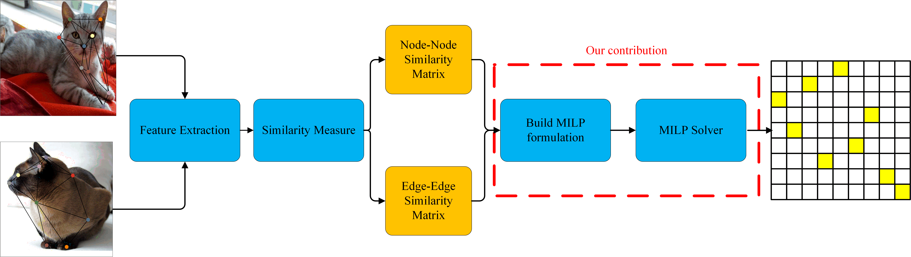

# Deep graph matching meets mixed-integer linear programming: Relax at your own risk ?
This repository contains PyTorch implementation of our Pattern Recognition paper: [Deep graph matching meets mixed-integer linear programming: Relax at your own risk ?](https://doi.org/10.1016/j.patcog.2024.110697)

The slides of the presentation on this paper by Romain Raveaux
http://romain.raveaux.free.fr/document/DifferantiableGraphMatching.pdf



The project directory is composed as follows:
- `experiments`: contains configuration files to reproduce the results reported in the paper;
- `models`: contains the implementation of the model based on difference graph matching solvers, such as DIP(ours), power_iteration and sinkhorn
- `utils`: several utils;

## Get started
### Quick Start
Here is a tutorial introducing what is the differentiable graph matching method on pattern recognition contributed by Romain Raveaux.
http://romain.raveaux.free.fr/document/AdifferentiablegraphmatchingmethodbasedILPV5.html

### Preliminary
1. Check if `findutils`(>=4.7.0) is available
2. Check if hdf5 is installed (apt install libhdf5-serial-dev)
3. Check if cuda 10.1 and cudnn 7 are available
4. Check if texlive-latex-extra is installed (`apt install texlive-latex-extra`)
5. Check if `torch_geometric` is installed
6. Check if `gurobipy` is installed

### Download data sets
Run the following command to download data sets PascalVOC and SPair-71K
```
chmod +x ./download_data.sh && ./download_data.sh
```

### Training
Run training and evaluation
```
python3 train_eval.py path/to/your/json
```
where `path/to/your/json` is the path to your configuration files. 
Our experimental configuration files are in `./experiments`.
